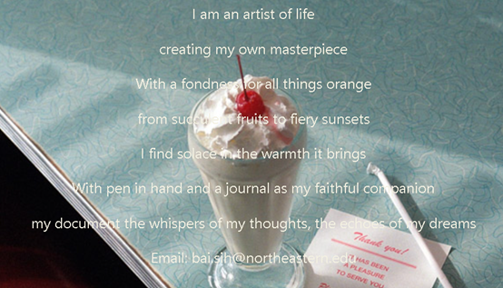
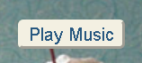
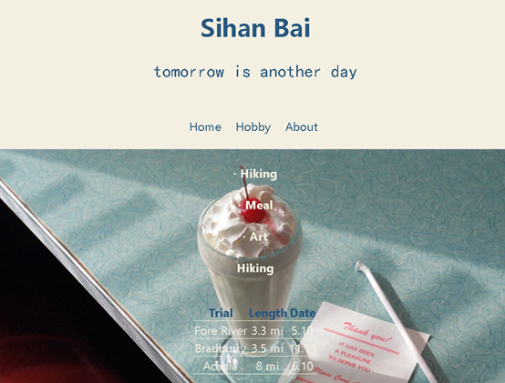
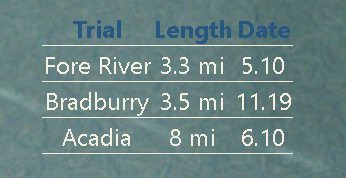

# Landing page:
https://github.khoury.northeastern.edu/sihan/PersonalWebsite/blob/main/landing.png

# Brief
My website has three parts: home, hobby and about.
Home page has a music player, a beautiful poem and my ins link.
Hobby page has a table and many pictures.
About page is something about me and my email address.

# Landing page
Landing page has three navigational elements. They are Home, Hobby and About. 
They are internal links, too.

In the landing page, I create a music play button as interactive component.
When you click on it, it will play a music.

If you would like to pause, click it again.

In the bottom of landing page, there is an ins icon as external link.
If you click on it, it will open a new browser which is my instagram page.

# Hobby page
Hobby page:

I created a table about my hiking.

# About page
About page:

